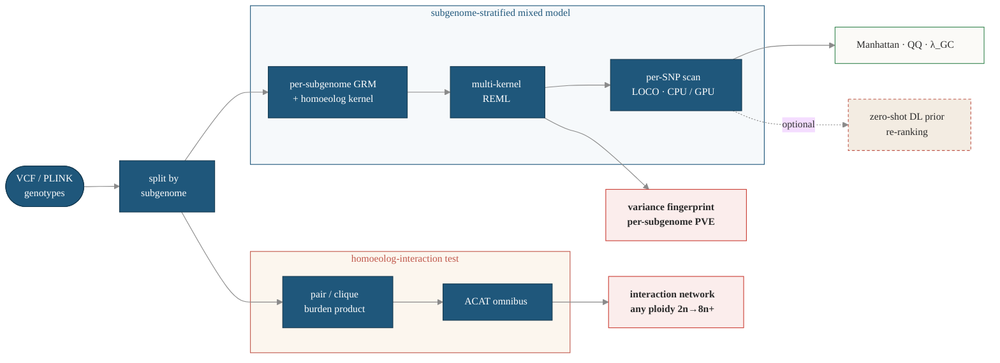

# HomoeoGWAS

**Subgenome-aware mixed-model GWAS for allopolyploid crops, with an optional zero-shot deep-learning prior.**

[](https://github.com/Shipeng-Yang/HomoeoGWAS/actions/workflows/ci.yml)
[](LICENSE)
[](pyproject.toml)
[](pyproject.toml)
[](#testing)
<!-- DOI badge added after the first Zenodo release:
[](https://doi.org/<10.5281/zenodo.XXXXXXX>) -->

HomoeoGWAS runs GWAS on **allopolyploid crops** (wheat, cotton, rapeseed, oat,
peanut, strawberry, …) by modelling each subgenome explicitly. A new species is added
through a single YAML config — no framework code changes. The only requirement
is that the subgenomes are distinguishable (a homoeologous chromosome naming or a
`chrom_map`); the optional deep-learning prior additionally needs a reference
FASTA.

It combines:

1. **Subgenome-partitioned linear mixed model** — `y = Xβ + u_A + u_B [+ u_D …] + ε`,
   with a per-subgenome GRM fit by REML and an optional leave-one-chromosome-out
   (LOCO) correction.
2. **Optional homoeolog interaction kernel** `K_hom = K_A ⊙ K_B [⊙ K_D]` for
   cross-subgenome epistasis.
3. **Optional zero-shot deep-learning prior** — PlantCaduceus + AgroNT
   log-likelihoods fused with the GWAS p-value to re-rank candidate loci.
4. **CPU and dual-GPU backends** for the per-SNP scan, scaling to tens of millions
   of markers.

## Quick start

```bash
# 1. Install (CPU)
pip install homoeogwas            # or: pip install -e ".[dev]" from a checkout

# 2. Verify the install end-to-end (~2 s): synthesise a tiny dataset + run a fit
homoeogwas demo --keep            # prints acceptance checks + lists the outputs

# 3. Run on your own data
homoeogwas validate -c my_run.yaml    # check config + input paths first
homoeogwas fit -c my_run.yaml -o results/my_run

# (Optional) GPU extras for the per-SNP scan + DL prior
pip install "homoeogwas[gpu]"
```

See [`examples/minimal/`](examples/minimal/) for the demo dataset + an annotated
config, and [the I/O contract](docs/io.md) for input/output formats. CLI
subcommands: `fit`, `validate`, `demo`, `split`, `interact`.

## Run it by talking to an AI agent (no YAML, no coding)

You do **not** have to write config files. HomoeoGWAS ships an **agent interface**:
tell an AI coding agent your data files and which trait you care about, and the
agent writes the configs, runs the analysis, and explains the results for you.
This is the fastest way for a breeder or bioinformatician to get going.

You just say, in plain language:

> "Run a subgenome-stratified GWAS on my wheat. Genotypes are in
> `data/A.bed`, `data/B.bed`, `data/D.bed`; phenotype is `pheno.tsv`,
> sample column `id`, trait `heading_date`. Then plot it."

The agent collects only those *biological* inputs and does the rest. Three ways
to connect, pick whichever matches the agent you already use:

```bash
# ── Option A · Claude Code (zero setup) ───────────────────────────────────────
# The skill is bundled at .claude/skills/homoeogwas/. Open this repo in Claude
# Code and just ask in plain language — the `homoeogwas` skill auto-activates.

# ── Option B · Any MCP client (Cursor, Cline, Windsurf, Claude Desktop, …) ─────
pip install "homoeogwas[mcp]"     # adds the MCP dependency
homoeogwas mcp                    # starts the MCP server (stdio)
# Then register this server in your client's MCP config. Minimal entry:
#   {"mcpServers": {"homoeogwas": {"command": "homoeogwas", "args": ["mcp"]}}}
#   ^ replace "command" with an absolute path if `homoeogwas` is not on PATH,
#     e.g. "/home/you/miniconda3/envs/poly/bin/homoeogwas"

# ── Option C · Any other LLM/agent (ChatGPT, Gemini, a custom bot) ────────────
# Point it at AGENTS.md in the repo root — that file IS the full, canonical
# spec the agent follows. No plugin needed; the agent reads it and drives the CLI.
```

`AGENTS.md` is the single source of truth; the Claude skill and the MCP server
both defer to it, so all three routes behave identically. Under the hood the
agent calls the same `src/homoeogwas/workflow.py` engine (high-level inputs →
auto-generated YAML → run → summary), and it **blocks on common mistakes**
(wrong chromosome naming, missing homoeolog map, …) before wasting a run.

**No GPU? You're fine — CPU is the default.** Plain `pip install homoeogwas`
runs everything on CPU; the agent uses `--backend auto`, which silently picks
GPU *only if one is present* and otherwise falls back to CPU with identical
results. A GPU is **purely optional acceleration** for the genome-wide per-SNP
scan and the deep-learning variant prior — never a requirement. So tell the
agent "use CPU" (or just say nothing) and it works on any laptop:

```bash
# Force CPU explicitly if you like (this is also the no-GPU auto behaviour):
homoeogwas fit -c run.yaml --backend cpu     # any machine, no GPU needed
homoeogwas fit -c run.yaml --backend auto    # GPU if available, else CPU (default)
homoeogwas fit -c run.yaml --backend gpu     # opt-in acceleration; needs CUDA
```

## Containers

```bash
# Docker — CPU (bundles plink2 + bcftools, so split/VCF -> fit all work)
docker build -t homoeogwas:cpu .
docker run --rm homoeogwas:cpu demo
docker run --rm -v "$PWD":/work -w /work homoeogwas:cpu fit -c run.yaml

# Docker — GPU (per-SNP scan + DL prior; CUDA 12.1)
docker build -f Dockerfile.gpu -t homoeogwas:gpu .
docker run --rm --gpus all -v "$PWD":/work -w /work homoeogwas:gpu fit -c run.yaml --backend gpu

# Apptainer / Singularity (HPC, no root) — convert the Docker image
apptainer build homoeogwas.sif docker-daemon://homoeogwas:cpu
apptainer run homoeogwas.sif demo
```

Pass `--build-arg PIP_INDEX_URL=<mirror>` to build through a faster pip mirror.

## How it works

One genotype file goes in; it is split by subgenome and feeds two analyses — a
**subgenome-stratified mixed model** (whose signature output is the per-subgenome
heritability partition) and a **homoeolog-interaction test** (whose output is the
interaction network). A zero-shot deep-learning variant prior can optionally
re-rank the scan.



The two red-bordered boxes — the **variance fingerprint** and the **interaction
network** — are HomoeoGWAS's two distinctive outputs; everything else is standard
GWAS machinery made subgenome-aware.

## Adding a new species

Any allopolyploid is supported through configuration alone:

1. Copy an existing `configs/species/*.yaml` and edit `subgenomes`, the
   chromosome naming / `chrom_map`, the reference assembly path, and `ploidy`.
   The schema in `src/homoeogwas/species_config.py` validates it.
2. `homoeogwas split --species <yaml> --vcf <in.vcf.gz> --out-dir ...` splits the
   markers into per-subgenome genotype sets. `K_hom` auto-selects its form for the
   subgenome count (full Hadamard for 2–3; pairwise-mean for 4+ to stay full-rank).
3. `homoeogwas fit --config <run.yaml>` runs the mixed-model scan; the optional
   DL-prior step additionally needs the species reference FASTA.

No Python is edited at any step. Diploids can run the mixed model, but the
homoeolog kernel `K_hom` is not meaningful for them.

## Tested species

The framework has been run end-to-end on six crops spanning ploidy 2n–8n through
the same code path; this list is illustrative, not a limit on supported species.

| Species | Subgenomes | Reference assembly |
|---|---|---|
| Wheat (*Triticum aestivum*)     | AABBDD (6n) | IWGSC RefSeq v1.0 |
| Cotton (*Gossypium hirsutum*)   | AADD (4n)   | HBAU NDM8 |
| Rapeseed (*Brassica napus*)     | AACC (4n)   | Darmor v4.1 |
| Peanut (*Arachis hypogaea*)     | AABB (4n)   | NDH108 (PeanutPan) |
| Oat (*Avena sativa*)            | AACCDD (6n) | OT3098 v2 |
| Strawberry (*Fragaria × ananassa*) | octoploid (4 subgenomes) | NIHHS Seolhyang |

## Package layout

```
src/homoeogwas/
├── species_config.py   # config schema (pydantic)
├── species_split.py    # VCF -> per-subgenome genotype splitter
├── grm.py              # per-subgenome and LOCO GRMs
├── kernel.py           # K_pool (additive) and K_hom (homoeolog) kernels
├── lmm.py              # multi-kernel REML mixed model
├── gp.py               # GBLUP prediction + cross-validation
├── scan.py             # per-SNP scan (CPU + dual-GPU, LOCO)
├── diagnostics.py      # lambda_GC, QQ, retained-fraction checks
├── calibration.py      # null-simulation type-I error
├── sim.py              # power-vs-FDR simulation
├── interact.py         # homoeolog-pair interaction scan
├── cli.py              # command-line interface
└── io.py               # genotype I/O
```

## Testing

```bash
pytest -m "not gpu and not slow"   # CPU suite (~3-5 min): 287 passed + 1 skipped
pytest -m "not slow"               # + GPU tests (needs torch)
pytest                             # full suite incl. simulation benchmarks
```

CI runs ruff + the CPU test suite on Python 3.10 / 3.11 / 3.12.

## Reproducing the paper

The analysis code, configs, and figure pipeline for the manuscript live under
[`reproducibility/`](reproducibility/). Large inputs (`data/`) and intermediate
outputs (`results/`) are not tracked; see `reproducibility/paper/` for how to
fetch the public datasets and regenerate the figures, and
`reproducibility/paper/scripts/reproduce_baselines.sh` to clone the external
benchmark tools.

## Status

This is research software released alongside a manuscript in preparation
(target *Nature Communications*). The package and its tests are stable; the
biological associations in the paper are the subject of that manuscript and
should be cited from it once published.

## Citation

```bibtex
@unpublished{homoeogwas2026,
  title  = {HomoeoGWAS: subgenome-aware mixed-model GWAS for allopolyploid crops},
  author = {Yang, Shipeng},
  year   = {2026},
  note   = {Manuscript in preparation},
  url    = {https://github.com/Shipeng-Yang/HomoeoGWAS},
}
```

See [`CITATION.cff`](CITATION.cff) for machine-readable metadata.

## License

MIT — see [LICENSE](LICENSE).
