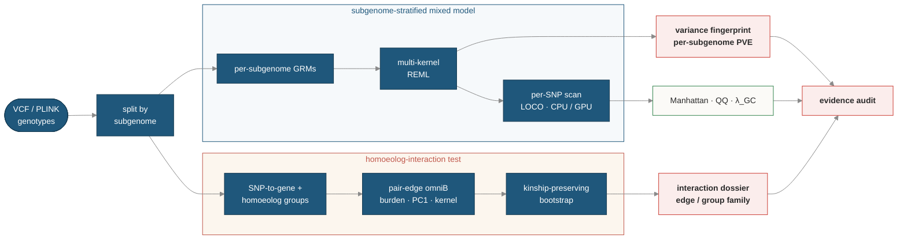

# HomoeoGWAS

**Subgenome-aware trait architecture and homoeolog-interaction analysis for allopolyploid crops.**

[](https://github.com/Shipeng-Yang/HomoeoGWAS/actions/workflows/ci.yml)
[](LICENSE)
[](pyproject.toml)
[](pyproject.toml)
[](#testing)
<!-- DOI badge added after the first Zenodo release:
[](https://doi.org/<10.5281/zenodo.XXXXXXX>) -->

> **Current release: [v2.0.1](https://github.com/Shipeng-Yang/HomoeoGWAS/releases/tag/v2.0.1)
> (29 August 2026).** This release unifies two-, three-, and four-copy
> homoeolog interaction analysis under one group-omniB engine, one declared
> bootstrap-minP family, and one auditable cross-species runtime contract.
> See the [full release notes](docs/releases/v2.0.1.md) and
> [changelog](CHANGELOG.md).

HomoeoGWAS runs GWAS on **allopolyploid crops** (wheat, cotton, rapeseed, oat,
peanut, strawberry, …) by modelling each subgenome explicitly. A new species is added
through a single YAML config — no framework code changes. The only requirement
is that the subgenomes are distinguishable (a homoeologous chromosome naming or a
`chrom_map`).

It combines:

1. **Subgenome-partitioned linear mixed model** — `y = Xβ + u_A + u_B [+ u_D …] + ε`,
   with a per-subgenome GRM fit by REML and an optional leave-one-chromosome-out
   (LOCO) correction.
2. **Gene-resolution homoeolog-group interaction tests** — one engine for 2,
   3 or 4+ copies, with pair omniB as the primitive and kinship-preserving
   bootstrap min-P as the experiment-wide calibration. omniB combines
   minor-burden, PC1 and kernel-Hadamard evidence while retaining all three
   components for interpretation.
3. **Evidence-aware outputs** — the per-subgenome variance fingerprint,
   interaction rankings, prediction comparison and a result audit that
   distinguishes internal discovery from replication.
4. **Scalable per-SNP scanning** — streaming CPU and optional CUDA backends for
   panels with tens of millions of markers.

The global `K_hom` kernel and phenotype-independent external priors remain
optional research extensions. They are not required for the primary variance
partition or interaction workflow and should not be treated as discovery
evidence without a frozen benchmark.

## What's new in v2.0.1

- **One interaction contract across ploidies:** pair edges are the shared
  primitive for dyads, triads, and four-copy groups, with one experiment-wide
  bootstrap-minP/FWER calibration.
- **Publication-grade evidence and stability:** complete component-aware
  rankings, `homoeogwas audit`, and material/environment deletion follow-up
  separate discovery, localization, internal stability, and replication.
- **Reproducible production execution:** observable process workers replace
  the former near-single-core threading path, while exact BIM-bound marker
  manifests prevent unverified SNP, PAV, SV, or haplotype inputs.

The formal claim is encoding-robust omnibus **pairwise** interaction evidence
within a homoeolog group. It is not a direct third- or fourth-order causal or
physical mechanism. See the [v2.0.1 release notes](docs/releases/v2.0.1.md) for
validation results and upgrade guidance.

## Quick start

```bash
# 1. Install the current v2.0.1 release (CPU)
python -m pip install \
  "homoeogwas @ https://github.com/Shipeng-Yang/HomoeoGWAS/archive/refs/tags/v2.0.1.tar.gz"
# Contributors may instead use: python -m pip install -e ".[dev]"

# 2. Verify the install end-to-end (~2 s): synthesise a tiny dataset + run a fit
homoeogwas demo --keep            # prints acceptance checks + lists the outputs

# 3. Run on your own data
homoeogwas validate -c my_run.yaml    # check config + input paths first
homoeogwas fit -c my_run.yaml -o results/my_run
homoeogwas audit results/my_run       # validity, uncertainty and evidence limits

# (Optional) GPU extras for the per-SNP scan
python -m pip install \
  "homoeogwas[gpu] @ https://github.com/Shipeng-Yang/HomoeoGWAS/archive/refs/tags/v2.0.1.tar.gz"
```

PyPI currently serves the older v1.0.1 package. Until v2.0.1 is published
there, use the versioned GitHub command above for new analyses; an unpinned
`pip install homoeogwas` will not install the algorithms described here.

See [`examples/minimal/`](examples/minimal/) for the demo dataset + an annotated
config, and [the I/O contract](docs/io.md) for input/output formats. Main CLI
subcommands: `split`, `validate`, `fit`, `predict`, `interact`, `follow-up`,
`registry`, `audit`, `plot`, `locus`, `rplot`, `design`, `prep-snps`, and
`prep-homoeologs`.

### Freeze several species in one production registry

HomoeoGWAS can generate, validate, resume, audit and index multiple species through one
species-independent registry:

```bash
homoeogwas registry validate -c analyses/cross_species_interaction_inventory.yaml
homoeogwas registry run -c analyses/cross_species_interaction_inventory.yaml --dry-run
```

Species are metadata. New two-, three- and four-copy interaction runs use the same pair-edge
group omniB engine; see [the registry guide](docs/run_registry.md).

### Stability and functional evidence for formal discoveries

After a canonical group omniB run, one species-independent command reproduces the formal
discoveries, performs deterministic material deletion, optionally deletes environments, merges
redundant units into reporting regions, and joins provenance-bound annotation, expression, QTL,
literature or functional evidence:

```bash
homoeogwas follow-up results/my_interaction \
  --material-folds 20 --n-jobs 16 \
  --environment-col environment \
  --evidence analyses/my_trait.evidence.yaml
```

The deletion analyses are candidate-only internal sensitivity checks, not a new discovery family
or independent replication. The command requires the full audited family and writes an immutable
identity-bound dossier, so edited rankings and stale output files fail closed. See
[the follow-up guide](docs/followup.md).

## Run it by talking to an AI agent (no YAML, no coding)

You do **not** have to write config files. HomoeoGWAS ships an **agent interface**:
tell an AI coding agent your data files and which trait you care about, and the
agent writes the configs, runs the analysis, and explains the results for you.
This is the fastest way for a breeder or bioinformatician to get going.

You just say, in plain language:

> "Run a subgenome-stratified GWAS on my wheat. Genotypes are in
> `data/A.bed`, `data/B.bed`, `data/D.bed`; phenotype is `pheno.tsv`,
> sample column `id`, trait `heading_date`. Then plot it."

The agent collects only those *biological* inputs and does the rest. Three ways
to connect, pick whichever matches the agent you already use:

```bash
# ── Option A · Claude Code (zero setup) ───────────────────────────────────────
# The skill is bundled at .claude/skills/homoeogwas/. Open this repo in Claude
# Code and just ask in plain language — the `homoeogwas` skill auto-activates.

# ── Option B · Any MCP client (Cursor, Cline, Windsurf, Claude Desktop, …) ─────
# Install the current release with the MCP dependency:
python -m pip install \
  "homoeogwas[mcp] @ https://github.com/Shipeng-Yang/HomoeoGWAS/archive/refs/tags/v2.0.1.tar.gz"
homoeogwas mcp                    # starts the MCP server (stdio)
# Then register this server in your client's MCP config. Minimal entry:
#   {"mcpServers": {"homoeogwas": {"command": "homoeogwas", "args": ["mcp"]}}}
#   ^ replace "command" with an absolute path if `homoeogwas` is not on PATH,
#     e.g. "/home/you/miniconda3/envs/poly/bin/homoeogwas"

# ── Option C · Any other LLM/agent (ChatGPT, Gemini, a custom bot) ────────────
# Point it at AGENTS.md in the repo root — that file IS the full, canonical
# spec the agent follows. No plugin needed; the agent reads it and drives the CLI.
```

`AGENTS.md` is the single source of truth; the Claude skill and the MCP server
both defer to it, so all three routes behave identically. Under the hood the
agent calls the same `src/homoeogwas/workflow.py` engine (high-level inputs →
auto-generated YAML → run → summary), and it **blocks on common mistakes**
(wrong chromosome naming, missing homoeolog map, …) before wasting a run.

**No GPU? You're fine — CPU is the default.** The versioned CPU installation
above runs everything on CPU; the agent uses `--backend auto`, which silently picks
GPU *only if one is present* and otherwise falls back to CPU with identical
results. A GPU is **purely optional acceleration** for the genome-wide per-SNP
scan — never a requirement. So tell the
agent "use CPU" (or just say nothing) and it works on any laptop:

```bash
# Force CPU explicitly if you like (this is also the no-GPU auto behaviour):
homoeogwas fit -c run.yaml --backend cpu     # any machine, no GPU needed
homoeogwas fit -c run.yaml --backend auto    # GPU if available, else CPU (default)
homoeogwas fit -c run.yaml --backend gpu     # opt-in acceleration; needs CUDA
```

## Containers

```bash
# Docker — CPU (bundles plink2 + bcftools, so split/VCF -> fit all work)
docker build -t homoeogwas:cpu .
docker run --rm homoeogwas:cpu demo
docker run --rm -v "$PWD":/work -w /work homoeogwas:cpu fit -c run.yaml

# Docker — GPU (per-SNP scan; CUDA 12.1)
docker build -f Dockerfile.gpu -t homoeogwas:gpu .
docker run --rm --gpus all -v "$PWD":/work -w /work homoeogwas:gpu fit -c run.yaml --backend gpu

# Apptainer / Singularity (HPC, no root) — convert the Docker image
apptainer build homoeogwas.sif docker-daemon://homoeogwas:cpu
apptainer run homoeogwas.sif demo
```

Pass `--build-arg PIP_INDEX_URL=<mirror>` to build through a faster pip mirror.

## How it works

One genotype file goes in; it is split by subgenome and feeds two analyses — a
**subgenome-stratified mixed model** (whose signature output is the per-subgenome
variance partition) and a **homoeolog-interaction test**. Their results feed one
evidence audit.


```mermaid
%%{init: {"theme":"base","themeVariables":{"fontFamily":"Helvetica, Arial, sans-serif","fontSize":"14px","lineColor":"#8A8A8A"}}}%%
flowchart LR
    G(["VCF / PLINK<br/>genotypes"]) --> S["split by<br/>subgenome"]

    subgraph MODEL["subgenome-stratified mixed model"]
        K["per-subgenome GRMs"] --> R["multi-kernel<br/>REML"]
        R --> SC["per-SNP scan<br/>LOCO · CPU / GPU"]
    end

    subgraph INT["homoeolog-interaction test"]
        I["SNP-to-gene +<br/>homoeolog groups"] --> N["pair-edge omniB<br/>burden · PC1 · kernel"]
        N --> C["kinship-preserving<br/>bootstrap"]
    end

    S --> K
    S --> I
    R --> V["variance fingerprint<br/>per-subgenome PVE"]
    SC --> O["Manhattan · QQ · λ_GC"]
    C --> W["interaction dossier<br/>edge / group family"]
    V --> A["evidence audit"]
    O --> A
    W --> A

    classDef stage fill:#1F577B,stroke:#13384f,color:#ffffff;
    classDef out   fill:#FBFAF7,stroke:#368650,color:#2A2A2A;
    classDef star  fill:#FBEDEC,stroke:#CB3E35,color:#2A2A2A,font-weight:bold;
    class G,S,K,R,SC,I,N,C stage;
    class O out;
    class V,W,A star;
    style MODEL fill:#F6F9FB,stroke:#1F577B,color:#1F577B;
    style INT   fill:#FCF6EE,stroke:#C0584C,color:#C0584C;
```

The red-bordered boxes — the **variance fingerprint**, **interaction dossier**
and **evidence audit** — are HomoeoGWAS's distinctive outputs.

### One interaction contract across ploidies

New interaction runs use one master `group_id,gene_<S>...` table and canonical
`mode: group`. A two-copy group has one pair edge, a three-copy group has three,
and a four-copy group has six. Edge omniB is the shared statistical primitive;
group omniB is ACAT over the group's pair edges. All directions share one
all-subgenome null model and one bootstrap-minP family—never separate AB/AD/BD
runs followed by a factor correction.

The generated config is
`<out_dir>/configs/interact.generated.group.omnib.yaml`. It declares one primary
unit: `edge` for formal homoeolog-pair discoveries, or `group` for formal
within-group omnibus evidence. The other layer and the three omniB components
are localization only unless `family_scope: joint` calibrates their union once.
Legacy pairwise/triad omniB configs remain readable. Formal canonical output is
INT-only; raw-scale sensitivity cannot inherit discovery fields.

A four-copy group therefore uses six supported pair interactions. HomoeoGWAS
never fits or claims a direct fourth-order coefficient. See the
[interaction input contract](docs/interact_inputs.md) and the
[strawberry example](docs/examples/strawberry_octoploid.md).

## Adding a new species

Any allopolyploid is supported through configuration alone:

1. Copy an existing `configs/species/*.yaml` and edit `subgenomes`, the
   chromosome naming / `chrom_map`, the reference assembly path, and `ploidy`.
   The schema in `src/homoeogwas/species_config.py` validates it.
2. `homoeogwas split --species-yaml <yaml> --vcf <in.vcf.gz> -o ...` splits the
   markers into per-subgenome genotype sets.
3. `homoeogwas fit --config <run.yaml>` runs the mixed-model scan. Interaction
   analysis additionally needs SNP-to-gene and homoeolog mappings; four copies
   become six pair edges in one group family, never one four-way test.

No Python is edited at any step. Diploids can run the mixed model, but they do
not have a cross-subgenome homoeolog interaction.

## Tested species

The framework has been run end-to-end on six crops spanning ploidy 2n–8n through
the same code path; this list is illustrative, not a limit on supported species.

| Species | Subgenomes | Reference assembly |
|---|---|---|
| Wheat (*Triticum aestivum*)     | AABBDD (6n) | IWGSC RefSeq v1.0 |
| Cotton (*Gossypium hirsutum*)   | AADD (4n)   | HBAU NDM8 |
| Rapeseed (*Brassica napus*)     | AACC (4n)   | Darmor v4.1 |
| Peanut (*Arachis hypogaea*)     | AABB (4n)   | NDH108 (PeanutPan) |
| Oat (*Avena sativa*)            | AACCDD (6n) | OT3098 v2 |
| Strawberry (*Fragaria × ananassa*) | octoploid (4 subgenomes) | NIHHS Seolhyang |

## Package layout

```
src/homoeogwas/
├── species_config.py   # config schema (pydantic)
├── species_split.py    # VCF -> per-subgenome genotype splitter
├── grm.py              # per-subgenome and LOCO GRMs
├── kernel.py           # K_pool (additive) and K_hom (homoeolog) kernels
├── lmm.py              # multi-kernel REML mixed model
├── gp.py               # GBLUP prediction + cross-validation
├── scan.py             # per-SNP scan (CPU + dual-GPU, LOCO)
├── diagnostics.py      # lambda_GC, QQ, retained-fraction checks
├── audit.py            # result evidence/status audit
├── calibration.py      # null-simulation type-I error
├── sim.py              # power-vs-FDR simulation
├── interact.py         # homoeolog-pair interaction scan
├── cli.py              # command-line interface
└── io.py               # genotype I/O
```

## Testing

```bash
pytest -m "not gpu and not slow"   # CPU suite; external-tool/GPU tests may skip
pytest -m "not slow"               # + GPU tests (needs torch)
pytest                             # full suite incl. simulation benchmarks
```

CI runs ruff + the CPU test suite on Python 3.10 / 3.11 / 3.12.

## Reproducing the paper

The manuscript analysis code, configs, source data for figures, and audit
material are maintained separately in
[Shipeng-Yang/HomoeoGWAS-reproducibility](https://github.com/Shipeng-Yang/HomoeoGWAS-reproducibility).
Raw inputs and large intermediate outputs are not tracked there; its README
documents the boundary between versioned reproduction material and
provider-hosted datasets.

The repository-side validation assessment and next biological priorities are in
[`docs/validation_inventory.md`](docs/validation_inventory.md) and
[`docs/roadmap_biology.md`](docs/roadmap_biology.md).

## Status

This is research software released alongside a manuscript in preparation
(target *Nature Communications*). The package and its tests are stable; the
biological associations in the paper are the subject of that manuscript and
should be cited from it once published.

## Citation

```bibtex
@unpublished{homoeogwas2026,
  title  = {HomoeoGWAS: subgenome-aware mixed-model GWAS for allopolyploid crops},
  author = {Yang, Shipeng},
  year   = {2026},
  note   = {Manuscript in preparation},
  url    = {https://github.com/Shipeng-Yang/HomoeoGWAS},
}
```

See [`CITATION.cff`](CITATION.cff) for machine-readable metadata.

## License

MIT — see [LICENSE](LICENSE).
