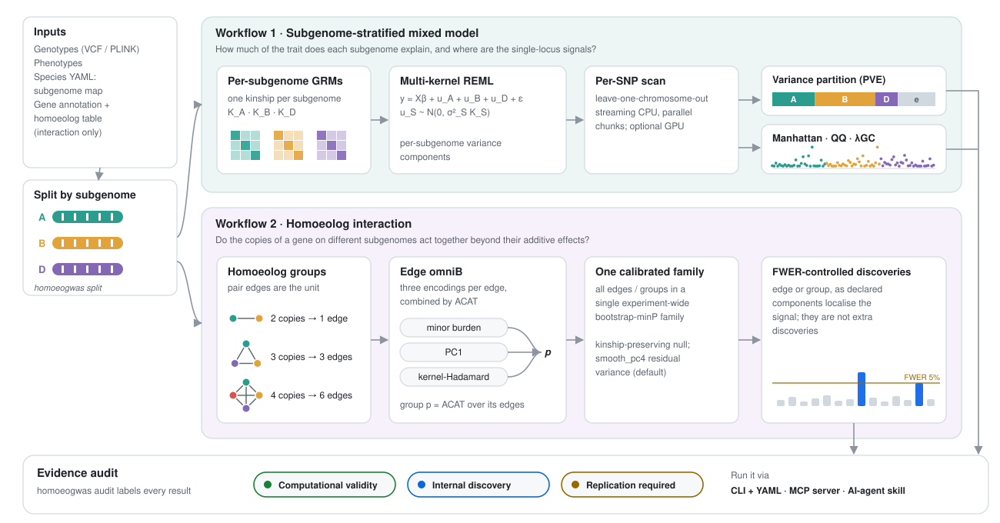

# HomoeoGWAS

Subgenome-aware trait architecture and homoeolog-interaction analysis for
**allopolyploid crops**. Current release: **v2.1.0** (2026-10-05).

1. **Subgenome-stratified mixed model** — `y = Xβ + u_A + u_B [+ u_D ...] + ε`,
   one kinship matrix per subgenome, a multi-kernel REML variance partition
   (per-subgenome PVE) and a leave-one-chromosome-out per-SNP scan.
2. **Homoeolog interaction** — pair-edge omniB (minor burden, PC1,
   kernel-Hadamard) for groups of 2, 3 or 4 homoeologous copies, calibrated as
   one experiment-wide bootstrap-minP family with a kinship-preserving null
   (`smooth_pc4` residual variance by default for agent-run analyses).
3. **Evidence audit** — every finished run is labelled as computationally
   valid, an internal discovery, or in need of replication.

The global homoeolog Hadamard kernel and phenotype-independent priors remain
optional research extensions.

→ **[Getting Started](getting_started.md)** for install + first run
→ **[Algorithm](algorithm.md)** for the model
→ **[API Reference](api.md)** for module-level docs
